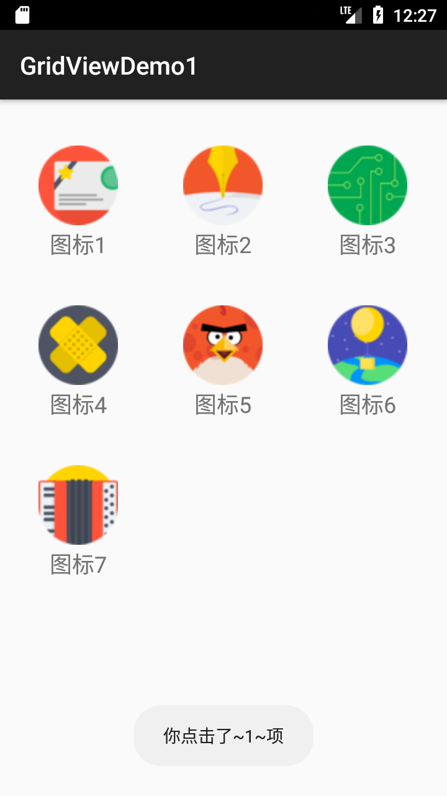

### GridView(网格视图)的基本使用
---
1. 相关属性
下面是GridView中的一些属性：
- android:columnWidth：设置列的宽度
- android:gravity：组件对其方式
- android:horizontalSpacing：水平方向每个单元格的间距
- android:verticalSpacing：垂直方向每个单元格的间距
- android:numColumns：设置列数
- android:stretchMode：设置拉伸模式，可选值如下：
            none：不拉伸；
            spacingWidth：拉伸元素间的间隔空隙
            columnWidth：仅仅拉伸表格元素自身
            spacingWidthUniform：既拉元素间距又拉伸他们之间的间隔空袭
2. 使用示例
实现的效果图：

